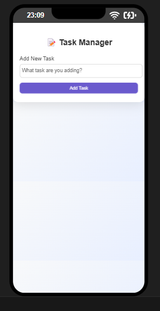

# 📝 React Task Manager

A simple, responsive, and interactive Task Manager built with **React.js**. This app allows you to add, edit, and delete tasks with a smooth user experience, designed for both desktop and mobile devices.

## 🚀 Features

- ✅ Add new tasks
- ✅ Edit existing tasks
- ✅ Delete tasks with confirmation
- ✅ Responsive design (mobile-friendly)
- ✅ Smooth animations and transitions
- ✅ Clean and modern user interface

## 📸 Preview

 

## 🛠️ Technologies Used

- **React** (Vite/CRA)
- **HTML5 & CSS3**
- **JavaScript (ES6)**
- **VS Code + Live Server for development**
- **Optional**: Framer Motion / LocalStorage (future upgrades)

## 📂 Project Structure

src/
├── components/
│ ├── AddTask.js # Form to add new tasks
│ ├── TaskItem.js # Each individual task item
│ └── TaskList.js # Displays the list of tasks
├── App.js # Main component
├── index.js # Entry point
└── index.css # Styling


---

## ⚙️ Getting Started

### 1️⃣ Clone the Repository

```bash
git clone https://github.com/M-Saleh-N/react-task-manager.git
cd react-task-manager

📱 Responsive Design
✅ Feature	Description
📲 Mobile	Full-width inputs & buttons
💻 Desktop	Card layout with smooth hover
🎨 Animations	Fade, slide-in, button scale

🌟 Future Plans
 LocalStorage support (keep tasks after refresh)

 Dark Mode toggle 🌙

 Mark as Completed feature ✅

 Framer Motion Animations ⚡

🤝 Contributing
Pull requests are welcome! For significant changes, open an issue first to discuss what you would like to change or add.

📃 License
This project is licensed under the MIT License — feel free to use it for personal or commercial projects.

👤 Author
Saleh Nasser

🔗 GitHub: https://github.com/M-Saleh-N